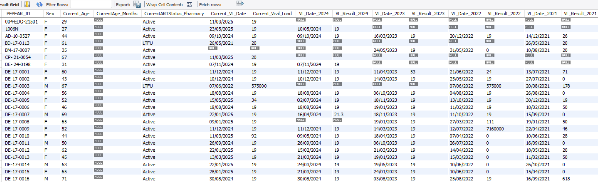

# Longitudinal Viral Load Extraction for OpenMRS (MySQL 5.7)

## Overview

This repository contains a portable SQL script that produces a longitudinal viral load (VL) dataset from an OpenMRS MySQL 5.7 database. The script extracts the most recent VL result for each patient overall and the most recent VL per year (2021–2024), joining these results with patient demographics, ART status, and facility details to produce a wide-format table suitable for reporting and analysis.

The SQL is written to be compatible with MySQL 5.7 (no CTEs or window functions). It uses techniques such as `UNION ALL`, aggregate `MAX(CASE WHEN ...)` pivoting, and careful joins to remain performant without temporary tables.

## Features

- **Overall most recent VL** per patient
- **Year-specific VLs** for 2021, 2022, 2023 and 2024
- **Patient demographics**: gender, age (years or months), primary identifier
- **Facility information**: state, LGA, DATIM code, facility name
- **ART status**: current status inferred from pharmacy encounters (Active / LTFU)
- **Wide-format output**: one row per patient for easy reporting and dashboards

## Requirements

- OpenMRS EMR database running on MySQL 5.7
- Relevant tables present: `obs`, `person`, `patient_identifier`, `encounter`, `location`, `address_hierarchy_entry`, `global_property`
- Indexes on frequently filtered columns (e.g., `obs.person_id`, `obs.concept_id`, `obs.obs_datetime`) for performance

## Usage

1. Clone or download this repository:

```bash
git clone https://github.com/yourusername/openmrs-vl-longitudinal.git
cd openmrs-vl-longitudinal
```

2. Open the SQL script in your MySQL client or run it from the command line (adjust the database name first). A working example is included at `sql/longitudinal_vl_example.sql`:

```sql
USE openmrs;
SOURCE sql/longitudinal_vl_example.sql;
```

3. Ensure these global properties exist in your OpenMRS database (replace names/keys with your site values if different):

- `partner_reporting_lga_code`
- `Facility_Datim_Code`
- `Facility_Name`

4. Important configuration notes:

- The script assumes the viral load observation concept has `concept_id = 856`. Change this ID if your instance uses a different concept.
- If you need data for different years, update the year-specific extraction blocks accordingly.

## Example output (short sample)



This single-row example shows how the output aggregates the overall most recent VL plus year-specific (2021–2024) VLs alongside demographics and facility info.

## Notes & Recommendations

- Test the script on a copy of your database or a subset of data first.
- Add or tune indexes if queries are slow on large datasets.
- If you migrate to MySQL 8.0 or a DBMS with window functions, you can simplify some queries and improve performance.

## Author

Sunday Elesi (SunnyInspired)

Technical Advisor, Health Informatics — FHI360, ECEWS SPEED Project

## License

This project is available under the MIT License. See the `LICENSE` file for details, or replace with your preferred license.

## Want help?

You can reach me via:
- Email: sundayelesi@gmail.com
- Phone: (+234) 810 1236 309
- LinkedIn: https://linkedin.com/in/sundayelesi
